<div align="center">

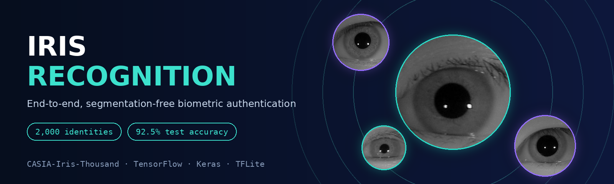

<br/>

[](https://www.kaggle.com/code/sondosaabed/iris-eye-recognition-endtoend-93)
[](https://github.com/sondosaabed/IrisRecognizer)


### Your eye is your password. Can a CNN read it with no segmentation at all?
**One CNN, 2,000 identities, 92.5% test accuracy, deployed to an Android app as TensorFlow Lite.**

[Why iris?](#-why-the-iris) ·
[Approach](#-the-approach) ·
[Dataset](#-the-dataset) ·
[Model](#-the-model) ·
[Results](#-results) ·
[The app](#-the-authenticator-app) ·
[Limitations](#-honest-limitations--bias) ·
[Cite](#-cite-this-work)

</div>

---

## 👁️ Why the iris?

Authentication comes in three flavors: **something you know** (password), **something you have** (USB key), and **something you are** (biometrics). The iris is one of the strongest "something you are" signals:

| | Why it works |
|---|---|
| 🧬 **Unique** | No two irises share the same pattern, not even a person's two eyes or identical twins |
| ⏳ **Stable** | Forms in childhood and stays essentially unchanged for life |
| 🔍 **Informative** | Rich texture: spots, stripes, filaments, coronas |
| 🛡️ **Safe** | Sits protected behind the cornea, so it is hard to forge or disturb |
| 🤲 **Contactless** | More hygienic than fingerprints |

<div align="center">

<br/>
<sub>The iris sits between the white sclera and the pupil.</sub>
</div>

---

## 🧭 The approach

Classic iris pipelines **segment** the iris first (find the pupil and limbus boundaries, unwrap the ring, extract features). This project skips all of that.

> **End-to-end, segmentation-free:** feed a lightly preprocessed eye image straight into a deep CNN and let it learn which parts matter.

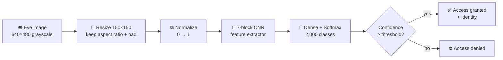

**Objectives:** design a biometric authentication system, analyze the iris dataset, build the recognition model (the *Verifier*), and build a mobile front-end (the *Authenticator*).

---

## 🗂️ The dataset

**[CASIA-Iris-Thousand](https://hycasia.github.io/dataset/casia-irisv4/)**: 20,000 near-infrared iris images from **1,000 subjects**, captured with the IKEMB-100 dual-eye camera. Left and right eyes are treated as separate identities, giving **2,000 classes** with **10 images each**, perfectly balanced. The main sources of intra-class variation are **eyeglasses and specular reflections**.

| | |
|---|---|
| Images | 20,000 (640×480, grayscale) |
| Classes | 2,000 (subject + left/right eye, e.g. `437-R`) |
| Images per class | 10 |
| Missing / duplicate values | none found |
| Split | 80 / 10 / 10 → **16,000 train · 2,000 val · 2,000 test** |

<div align="center">
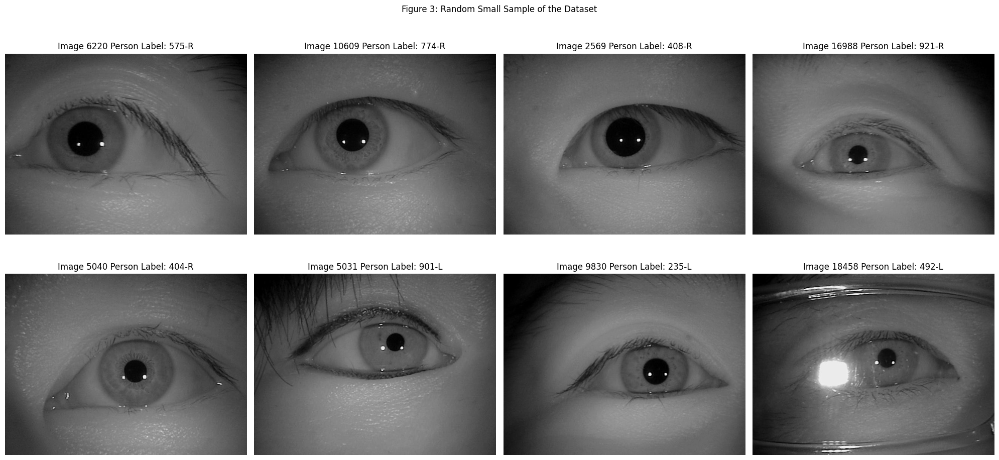
<br/>
<sub>Eyeglasses, eyeliner, glare, and very different eye openings all appear in the data.</sub>
</div>

<details>
<summary><b>📊 Dataset distributions (click to expand)</b></summary>
<br/>

All images share the same size and a ~1.3 aspect ratio, and every class has exactly 10 images.

<table>
<tr>
<td>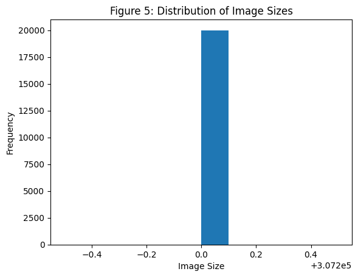</td>
<td>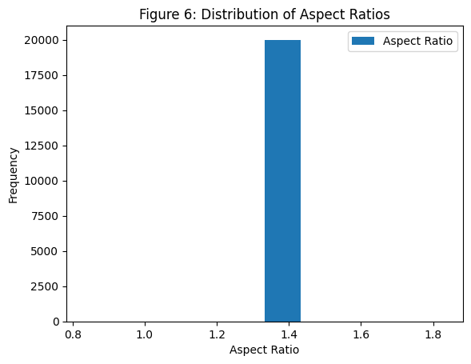</td>
</tr>
</table>

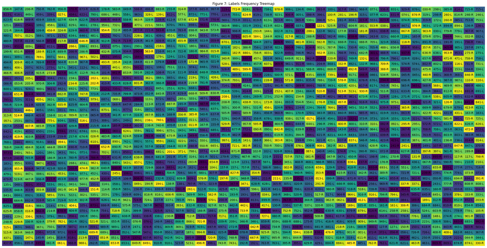

</details>

### Minimal preprocessing, on purpose

1. Read as grayscale
2. Resize to **150×150 keeping the aspect ratio**, with centered padding (no distortion)
3. Normalize pixels to **[0, 1]**
4. Encode labels with `LabelEncoder`

<div align="center">
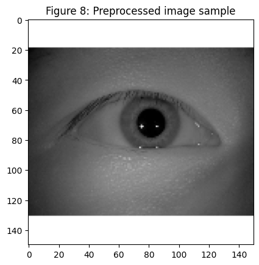
</div>

<details>
<summary><b>🧪 Experiment that didn't help: augmentation</b></summary>
<br/>

I tried training on augmented images (a 50% central crop). It **did not improve results**. My hypothesis is that this task needs data *synthesis* rather than simple augmentation, and that cropping can throw away exactly the fine iris texture the model relies on. The final model trains on the plain preprocessed images.

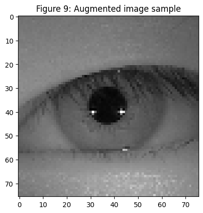

</details>

---

## 🧠 The model

A 7-block CNN feature extractor followed by a dense softmax classifier, with **3.7 M parameters (14.1 MB)**.

```
Input 150×150×1
 ├─ Conv 5×5 (32)  → BN → MaxPool → GaussianNoise(0.1) → Dropout(0.10)
 ├─ Conv 5×5 (64)  → BN → MaxPool → Dropout(0.10)
 ├─ Conv 5×5 (128) → BN → MaxPool → Dropout(0.25)
 ├─ Conv 3×3 (256) → BN → MaxPool → Dropout(0.25)
 ├─ Conv 3×3 (256) → BN → MaxPool → Dropout(0.25)
 ├─ Conv 3×3 (512) → BN → MaxPool → Dropout(0.45)
 ├─ Conv 2×2 (512) → BN → MaxPool → Dropout(0.50)
 └─ Flatten → Dense(128) → Dense(2000, softmax)
```

| Setting | Value |
|---|---|
| Activation | LeakyReLU |
| Optimizer | Adam, initial LR `1e-3` |
| Loss | Sparse categorical cross-entropy |
| Batch size / max epochs | 32 / 100 |
| Callbacks | `EarlyStopping` (patience 10) · `ModelCheckpoint` (best val loss) · `ReduceLROnPlateau` (×0.1, patience 7) |
| Regularization | Batch norm + progressively heavier dropout + Gaussian noise |

**Design choice:** dropout ramps from 0.10 in early layers up to 0.50 in the last block. Early layers learn general edges and textures, so they are protected. The deep, high-capacity layers are where memorization happens, so they are regularized hardest.

---

## 📈 Results

Training early-stopped after **79 epochs** (the learning rate stepped down twice along the way).

<div align="center">
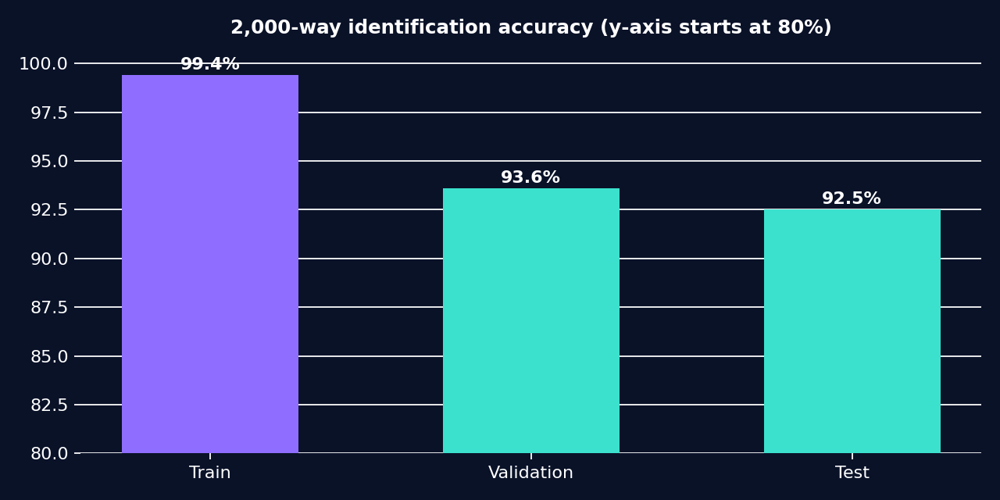
</div>

| Metric (test set, 2,000 images) | Value |
|---|:---:|
| **Accuracy** (2,000-way) | **92.5%** |
| Precision / Recall (micro-averaged, so equal to accuracy) | 0.925 / 0.925 |
| Mean top-class confidence | 0.975 |
| Median top-class confidence | 0.99999 |
| Confidence threshold used in the app | 0.704 |

### Learning curves

<table>
<tr>
<td>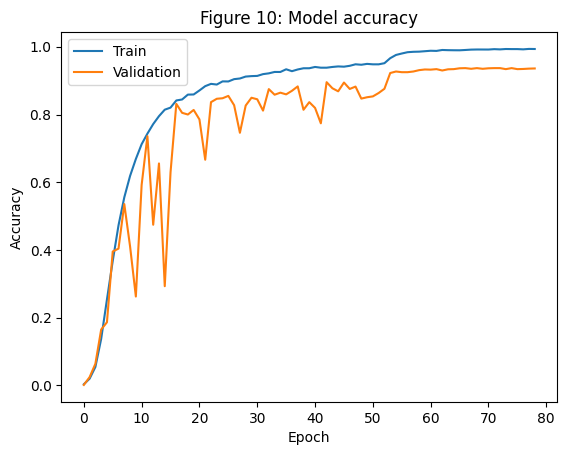</td>
<td>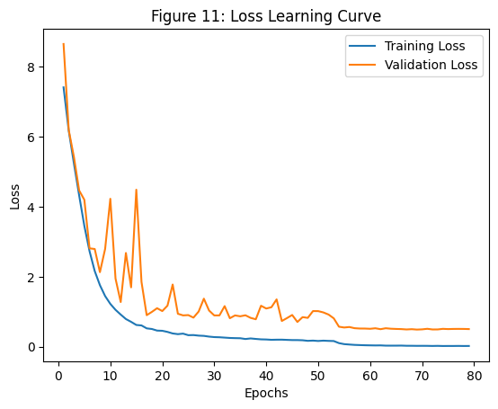</td>
</tr>
</table>

Validation accuracy is noisy for the first ~50 epochs (a combination of heavy dropout, batch norm, and a 2,000-class problem with only ~8 training images per class), then settles once the learning rate drops.

### Sample predictions
Each title reads `true : predicted`. **23 of 24 correct (95.8%)** on this batch. The one miss (`016-R` → `890-R`) still got the eye *side* right, which suggests the model captures left/right structure.

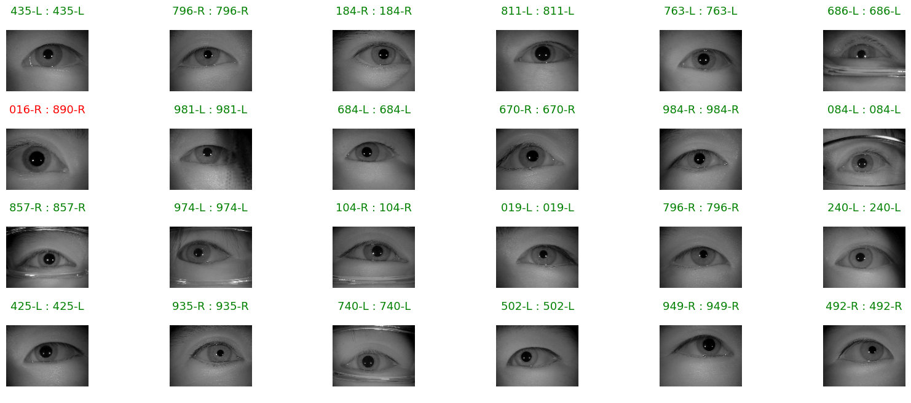

### Biometric metrics: FMR, FNMR, ROC, EER

The notebook evaluates the standard biometric quantities: **False Match Rate** (impostor accepted), **False Non-Match Rate** (genuine user rejected), a per-class **ROC curve**, and the **Equal Error Rate** crossing point. The mean per-class EER crossing value came out at **0.0006**.

<details>
<summary><b>📉 Per-class ROC curves (and a caveat)</b></summary>
<br/>

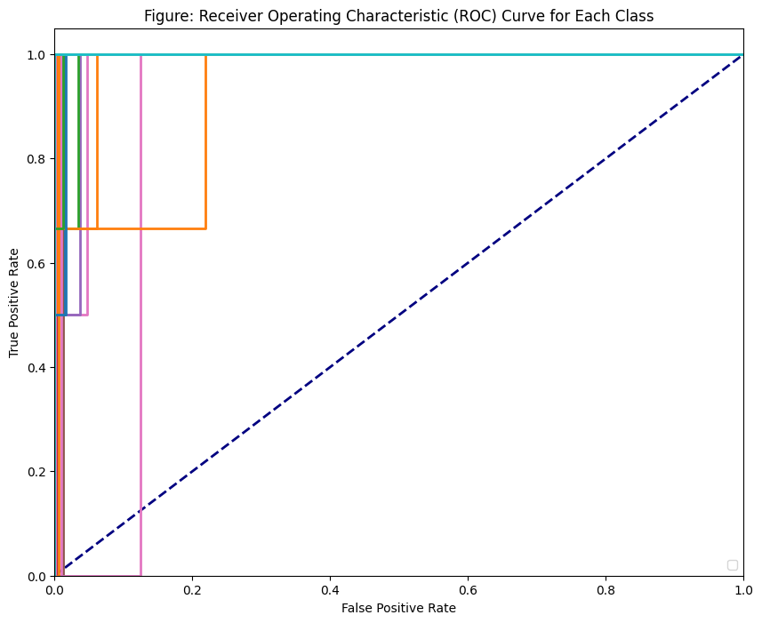

**Caveat:** with 2,000 test images spread over 2,000 classes, each class has only about one positive test sample, so each per-class ROC is a coarse step function. Treat the EER figure as indicative rather than a rigorous estimate. A larger, per-class-balanced evaluation (or verification-style genuine/impostor pair testing) would be more reliable.

</details>

---

## 📱 The authenticator app

To prove the concept, the trained model is exported to **TensorFlow Lite** (default quantization) and deployed in an Android app, **[IrisRecognizer](https://github.com/sondosaabed/IrisRecognizer)**.

| Flow | How it works |
|---|---|
| **Authenticate** | Capture an iris photo with the camera → same preprocessing as training → model returns class probabilities → if the top probability clears the threshold, access is granted and the identity + confidence are shown; otherwise the user is redirected to a "denied" screen |
| **Enroll** | Pick left-eye and right-eye images from the gallery. The design uses *continuous training*: enrolled images are added to the dataset and the model retrains so it can recognize the new identity |

<div align="center">


<br/>
<sub>Preferences and first-time setup (left) · image acquisition: enroll or authenticate (right)</sub>
<br/><br/>


<br/>
<sub>The two possible answers after model inference</sub>
</div>

> The TFLite conversion cells in the notebook are commented out, and the enrollment retraining loop is described as a design and left as future work.

---

## ⚠️ Honest limitations & bias

I'd rather flag these than hide them:

- **Accuracy isn't security-grade yet.** 92.5% is promising for a minimally-preprocessed model, but an authentication system should approach state-of-the-art (~99%) and generalize to *new* datasets.
- **Generalization gap.** Training accuracy is ~99.4% versus 92.5% on test, so the model overfits to some degree despite heavy regularization.
- **Dataset bias.** CASIA-Iris-Thousand subjects are predominantly Asian. Because there is no segmentation, the model also sees the surrounding eye and skin. It could therefore perform worse, or behave unfairly, for people with other ethnic backgrounds and skin tones. This needs testing on more diverse data before any real-world use.
- **Closed-set classifier.** A softmax over 2,000 known identities can't natively reject unknown people. The confidence threshold is a workaround, and the enrollment story depends on retraining.
- **Random image-level split.** Images of the same eye appear in train, validation, and test (that is inherent to closed-set identification), so this measures identification of *known* eyes, not verification of unseen ones.
- **Privacy.** Biometric data is sensitive. A production system needs secure template storage, consent, and liveness/anti-spoofing checks.

### Ideas for next steps
- [ ] Verification-style training (Siamese / triplet / ArcFace-style embeddings) for open-set matching
- [ ] Transfer learning from a pretrained backbone
- [ ] Data synthesis and stronger augmentation
- [ ] Evaluation on additional, more diverse iris datasets
- [ ] Anti-spoofing / liveness detection
- [ ] Complete the on-device enrollment loop

---

## 🚀 Run it

**Kaggle (easiest):** open the [notebook on Kaggle](https://www.kaggle.com/code/sondosaabed/iris-eye-recognition-endtoend-93), attach the **CASIA-Iris-Thousand** dataset, enable a GPU, and run all cells.

**Locally:**

```bash
git clone https://github.com/sondosaabed/Iris-of-eyes-recognition.git
cd Iris-of-eyes-recognition
pip install tensorflow==2.15.0 opencv-python pillow pandas numpy matplotlib seaborn scikit-learn scipy squarify torch torchmetrics
```

Then point the loader at your copy of the dataset:

```python
df, labels, images = load_dataset('path/to/CASIA-Iris-Thousand/CASIA-Iris-Thousand')
```

### Software

| Tool | Version |
|---|---|
| Python | 3.12.2 |
| TensorFlow / Keras | 2.15.0 |
| NumPy / pandas | 1.26.4 / 2.2.2 |
| OpenCV / Pillow | 4.9.0 / 9.5.0 |
| scikit-learn, matplotlib, squarify, torch, torchmetrics | latest at time of writing |

> **Dataset note:** CASIA-Iris-Thousand is distributed by the Chinese Academy of Sciences Institute of Automation (CASIA) under its own usage terms. The dataset itself is not included in this repo. Please obtain it from the source and follow its license.

---

## 🗃️ Repository structure

```
├── Iris_recognition_1190652.ipynb   # analysis → preprocessing → model → evaluation → export
├── assets/                          # figures used in this README
└── README.md
```

---

## 📚 References

1. Yin et al., [*Deep Learning for Iris Recognition: A Review*](https://arxiv.org/abs/2303.08514) (2024)
2. [CASIA-Iris V4 dataset](https://hycasia.github.io/dataset/casia-irisv4/)
3. [The Impact of Preprocessing on Deep Representations for Iris Recognition on Unconstrained Environments](https://www.researchgate.net/publication/327288671_The_Impact_of_Preprocessing_on_Deep_Representations_for_Iris_Recognition_on_Unconstrained_Environments)
4. [TorchMetrics: AUROC](https://lightning.ai/docs/torchmetrics/stable/classification/auroc.html) · [scikit-learn ROC example](https://scikit-learn.org/stable/auto_examples/model_selection/plot_roc.html)
5. [Introduction to TensorFlow Lite examples](https://github.com/sondosaabed/Introduction-to-Tensorflow-lite/blob/main/notebooks/Intro%20Code%20Examples.ipynb)

---

## 📝 Cite this work

If you find this useful in your research or projects, please cite it:

```
Sondos, "An End-to-end segmentation-free approach Iris Biometric Authentication",
Open Source (GitHub & Kaggle), May 2024.
https://github.com/sondosaabed/Iris-of-eyes-recognition
https://www.kaggle.com/code/sondosaabed/iris-eye-recognition-endtoend-93
```

---

<div align="center">

**Built by [Sondos Aabed](https://github.com/sondosaabed)**

⭐ If this project helped you, consider giving it a star!

</div>
